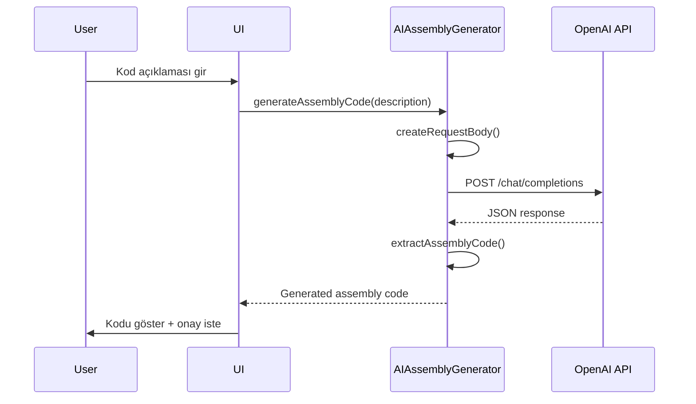

# Paket Bazlı Mimari Analizi

Bu dokümant, projenin 6 ana paketini detaylı olarak analiz eder ve her paketin sorumluluklarını, sınıflar arası ilişkilerini ve tasarım desenlerini açıklar.

## 📦 Paket Genel Bakışı

```
assembler/
├── assembler (Root Package)          - Ana orkestrasyon
├── assembler.core                     - Veri modelleri ve temel yapılar  
├── assembler.parser                   - Assembly kod parsing
├── assembler.assembler               - Makine kodu üretimi
├── assembler.simulator               - CPU simülasyonu
├── assembler.ai                      - AI destekli kod üretimi
├── assembler.ui                      - Kullanıcı arayüzü
└── assembler.util                    - Yardımcı sınıflar
```

## 🎯 assembler (Root Package)

### Paket Amacı
Ana uygulamanın entry point'i ve tüm alt sistemlerin koordinasyonunu sağlar.

### Sınıflar

#### App.java - Application Orchestrator
```java
// Dependency Injection Pattern kullanımı
public class App {
    private final ConsoleUI ui;              // UI katmanı
    private final AssemblyParser parser;     // Parsing katmanı  
    private final CodeGenerator codeGenerator; // Code gen katmanı
    private final ExecutionEngine simulator;   // Simulation katmanı
    
    // Facade Pattern - karmaşık alt sistemleri basit interface ile expose eder
    public void run() { /* Main application loop */ }
}
```

### Tasarım Desenleri
- **Facade Pattern**: Alt sistemlerin karmaşıklığını gizler
- **Dependency Injection**: Constructor'da bağımlılıkları enjekte eder
- **Command Pattern**: Kullanıcı seçimlerini metot çağrılarına dönüştürür

### Sorumluluklar
1. ✅ Uygulama lifecycle yönetimi
2. ✅ Alt sistem koordinasyonu  
3. ✅ Ana kullanıcı döngüsü
4. ✅ Global hata yönetimi
5. ✅ Assembly pipeline kontrolü

---

## 🗂️ assembler.core (Veri Modelleri)

### Paket Amacı
6800 assembly ve CPU simülasyonu için gerekli temel veri yapılarını sağlar.

### Sınıf Hiyerarşisi

```
Core Models
├── AddressingMode (Enum)          - 7 adreslenme türü
├── Instruction                    - Assembly komut modeli
├── Label                         - Sembolik adres modeli  
├── Memory                        - 64KB bellek simülasyonu
└── Registers                     - CPU register seti
```

### Detaylı Sınıf Analizi

#### AddressingMode.java - Value Object Pattern
```java
public enum AddressingMode {
    INHERENT("Inherent", 0, "No operand"),
    IMMEDIATE("Immediate", 1, "#data"),
    // ... diğer mode'lar
    
    // Encapsulation: private fields with public getters
    private final String name;
    private final int operandSize;
    private final String format;
}
```

#### Instruction.java - Immutable Data Transfer Object
```java
public class Instruction {
    // Immutable fields (final)
    private final String mnemonic;
    private final AddressingMode addressingMode;
    private final int opcode;
    
    // Mutable state (resolved during parsing)  
    private String operand;
    private int resolvedOperand;
}
```

#### Memory.java - Encapsulated Array Wrapper
```java
public class Memory {
    private final byte[] memory = new byte[65536]; // 64KB
    
    // Bounds checking in all methods
    public void writeByte(int address, int value) {
        validateAddress(address);
        memory[address] = (byte) (value & 0xFF);
    }
}
```

### Tasarım Desenleri
- **Value Object Pattern**: AddressingMode için immutable enum
- **Data Transfer Object**: Instruction ve Label için
- **Encapsulation**: Memory ve Registers için controlled access
- **Factory Method**: Instruction creation için multiple constructors

### Sorumluluklar
1. ✅ 6800 CPU state modeling
2. ✅ Assembly instruction representation  
3. ✅ Memory address space management
4. ✅ Type safety for addressing modes
5. ✅ Data validation ve bounds checking

---

## 🔍 assembler.parser (Parsing Katmanı)

### Paket Amacı
Assembly kaynak kodunu parse eder, syntax validation yapar ve internal representation'a dönüştürür.

### Sınıf İlişkileri

```
AssemblyParser (Main Coordinator)
├── SyntaxValidator               - Sözdizimi kontrolü
├── LabelResolver                 - İki geçişli label çözümü
├── TokenParser                   - Lexical analysis
└── AssemblyLine                  - Parse sonucu container
```

### Parsing Pipeline

```
Raw Source Code
    │
    ▼
[TokenParser] ─── tokenize() ──► List<String> tokens
    │
    ▼
[SyntaxValidator] ─── validate() ──► Syntax OK
    │
    ▼  
[AssemblyParser] ─── parseLine() ──► AssemblyLine objects
    │
    ▼
[LabelResolver] ─── resolve() ──► Resolved references
    │
    ▼
Parsed Program (List<AssemblyLine>)
```

### Detaylı Sınıf Analizi

#### AssemblyParser.java - Coordinator/Facade
```java
public class AssemblyParser {
    // Strategy Pattern: Parser farklı parsing stratejileri kullanabilir
    private final SyntaxValidator validator;
    private final LabelResolver labelResolver;
    private final TokenParser tokenParser;
    
    // Template Method Pattern: parseSource() template, parseLine() steps
    public List<AssemblyLine> parseSource(String sourceCode) {
        // Template steps:
        // 1. Split into lines
        // 2. Parse each line
        // 3. Collect results
    }
}
```

#### LabelResolver.java - Two-Pass Algorithm Implementation
```java
public class LabelResolver {
    // First pass: collect definitions
    private Map<String, Integer> labelDefinitions;
    
    // Second pass: resolve references  
    private List<LabelReference> unresolvedReferences;
    
    // Inner class for unresolved references
    private static class LabelReference {
        String labelName;
        int lineNumber;
        int address;
    }
}
```

#### AssemblyLine.java - Composite Data Container
```java
public class AssemblyLine {
    // Line metadata
    private final int lineNumber;
    private final String sourceLine;
    
    // Parsed components (optional)
    private Label label;              // null if no label
    private Instruction instruction;  // null if pseudo-op or empty
    private String pseudoOp;         // null if regular instruction
    private Object pseudoOperand;    // varies by pseudo-op type
    
    // Resolved information
    private int address = -1;         // set during address calculation
    private List<Integer> machineCode; // set during code generation
}
```

### Tasarım Desenleri
- **Strategy Pattern**: Farklı parsing strategies
- **Template Method**: parseSource() method template
- **Composite Pattern**: AssemblyLine farklı component türlerini içerir
- **Two-Pass Algorithm**: Label resolution için klasik algoritma

### Sorumluluklar
1. ✅ Lexical analysis (tokenization)
2. ✅ Syntax validation
3. ✅ Label resolution (two-pass)
4. ✅ Pseudo-instruction handling
5. ✅ Error reporting with line numbers

---

## ⚙️ assembler.assembler (Code Generation)

### Paket Amacı
Parse edilmiş assembly kodundan makine kodu üretir ve opcode management yapar.

### Sınıf Yapısı

```
CodeGenerator (Main Generator)
├── OpcodeTable                   - 197 opcode repository
└── CodeGenerationException       - Error handling
```

### Code Generation Pipeline

```
List<AssemblyLine> (Parsed)
    │
    ▼
[CodeGenerator.generateCode()]
    │
    ├── For each line:
    │   ├── generateLineCode()
    │   │   ├── Handle pseudo-ops (ORG, FCB, FDB)
    │   │   └── Handle instructions:
    │   │       ├── opcodeTable.lookup(mnemonic, mode)
    │   │       ├── Encode operand by addressing mode
    │   │       └── Create byte array
    │   │
    │   └── Add to machineCode map
    │
    ▼
Map<Integer, List<Integer>> (Machine Code)
```

### Detaylı Sınıf Analizi

#### CodeGenerator.java - Strategy + Factory Pattern
```java
public class CodeGenerator {
    private final OpcodeTable opcodeTable; // Repository Pattern
    
    // Strategy Pattern: Different generation strategies for different line types
    private List<Integer> generateLineCode(AssemblyLine line) {
        if (line.isPseudoOp()) {
            return generatePseudoOpCode(line);     // Strategy 1
        } else if (line.getInstruction() != null) {
            return generateInstructionCode(line);   // Strategy 2  
        }
        return new ArrayList<>();                   // Strategy 3 (empty)
    }
    
    // Factory Method Pattern: Operand encoding based on addressing mode
    private List<Integer> encodeOperand(int operand, AddressingMode mode) {
        switch (mode) {
            case IMMEDIATE:
            case DIRECT:
            case INDEXED:
            case RELATIVE:
                return Arrays.asList(operand & 0xFF);        // 1 byte
            case EXTENDED:
                return Arrays.asList((operand >> 8) & 0xFF,  // High byte
                                   operand & 0xFF);          // Low byte
            default:
                return new ArrayList<>();
        }
    }
}
```

#### OpcodeTable.java - Repository Pattern
```java
public class OpcodeTable {
    // Repository: In-memory storage of all opcodes
    private final Map<String, Instruction> instructionMap;
    
    // Key format: "MNEMONIC_ADDRESSINGMODE"
    // Example: "LDA_IMMEDIATE", "BEQ_RELATIVE"
    
    public Instruction getInstruction(String mnemonic, AddressingMode mode) {
        String key = mnemonic + "_" + mode.name();
        return instructionMap.get(key);
    }
    
    // Initialization: All 197 opcodes loaded at startup
    private void initializeInstructions() {
        // Load/Store instructions
        addInstruction("LDA", IMMEDIATE, 0x86, 2, "Load accumulator A immediate");
        addInstruction("LDA", DIRECT, 0x96, 3, "Load accumulator A direct");
        // ... 195 more opcodes
    }
}
```

### Tasarım Desenleri
- **Repository Pattern**: OpcodeTable for opcode storage
- **Strategy Pattern**: Different code generation strategies
- **Factory Method**: Operand encoding factory
- **Template Method**: generateCode() template with steps

### Sorumluluklar
1. ✅ Opcode lookup ve validation
2. ✅ Operand encoding (by addressing mode)
3. ✅ Pseudo-instruction handling (ORG, FCB, FDB)
4. ✅ Machine code byte generation
5. ✅ Address calculation ve mapping

---

## 🖥️ assembler.simulator (CPU Simülasyonu)

### Paket Amacı
6800 CPU'nun cycle-accurate simülasyonunu sağlar ve debugging desteği sunar.

### Sınıf Hiyerarşisi

```
ExecutionEngine (High-level Controller)
├── CPU6800 (Low-level Simulator)  
│   ├── Registers (CPU State)
│   └── Memory (64KB Space)
├── ExecutionResult (Result DTO)
├── ExecutionStatus (Status Enum)
└── ExecutionStatistics (Metrics)
```

### Simulation Architecture

```
[ExecutionEngine] ◄──── Program Loading
    │
    ├── High-level control (step, run, breakpoints)
    │
    ▼
[CPU6800] ◄──── Instruction Execution
    │
    ├── Fetch-Decode-Execute cycle
    ├── Register management
    ├── Memory access
    └── Flag updates
    │
    ▼
[ExecutionResult] ◄──── Result packaging
```

### Detaylı Sınıf Analizi

#### ExecutionEngine.java - Facade + Controller
```java
public class ExecutionEngine {
    private final CPU6800 cpu;                    // Delegation target
    private Map<Integer, AssemblyLine> addressToLineMap; // Debug mapping
    
    // Facade Pattern: Simple interface to complex CPU operations
    public ExecutionResult step() {
        int pc = getCurrentPC();
        AssemblyLine currentLine = addressToLineMap.get(pc);
        
        boolean success = cpu.step();              // Delegate to low-level
        instructionsExecuted++;
        
        return new ExecutionResult(/* ... */);     // Package results
    }
    
    // Template Method: Run with breakpoint checking
    public ExecutionResult run() {
        while (!cpu.isHalted()) {
            if (breakpoints.contains(getCurrentPC())) {
                return new ExecutionResult(BREAKPOINT, /* ... */);
            }
            step();
        }
        return new ExecutionResult(HALTED, /* ... */);
    }
}
```

#### CPU6800.java - State Machine Pattern
```java
public class CPU6800 {
    private final Registers registers;      // CPU state
    private final Memory memory;           // Memory subsystem
    private boolean halted;                // Machine state
    
    // State Machine: Fetch-Decode-Execute cycle
    public boolean step() {
        if (halted) return false;
        
        // Fetch
        int opcode = memory.readByte(registers.getProgramCounter());
        registers.incrementPC();
        
        // Decode & Execute  
        return executeInstruction(opcode);
    }
    
    // Strategy Pattern: Different execution strategies per instruction
    private boolean executeInstruction(int opcode) {
        switch (opcode) {
            case 0x86: executeLDA_IMM(); break;     // Strategy 1
            case 0x27: executeBEQ_REL(); break;     // Strategy 2  
            // ... 195 more strategies
            default: return false; // Invalid opcode
        }
        return true;
    }
}
```

#### ExecutionResult.java - Data Transfer Object
```java
public class ExecutionResult {
    // Immutable result packaging
    private final ExecutionStatus status;      // RUNNING, HALTED, BREAKPOINT
    private final int programCounter;          // PC during execution
    private final String message;              // Status message
    private final AssemblyLine assemblyLine;   // Executed line (for debugging)
    
    // Factory methods for different result types
    public static ExecutionResult success(int pc, AssemblyLine line) { /* ... */ }
    public static ExecutionResult breakpoint(int pc, String message) { /* ... */ }
    public static ExecutionResult halted(int pc, String reason) { /* ... */ }
}
```

### Tasarım Desenleri
- **Facade Pattern**: ExecutionEngine simple interface
- **State Machine**: CPU6800 execution states
- **Strategy Pattern**: Instruction execution strategies  
- **Observer Pattern**: Statistics collection
- **Data Transfer Object**: ExecutionResult

### Sorumluluklar
1. ✅ Fetch-decode-execute cycle simulation
2. ✅ CPU register ve flag management
3. ✅ Memory access simulation
4. ✅ Breakpoint management
5. ✅ Execution statistics collection
6. ✅ Debug information provision

---

## 🤖 assembler.ai (AI Destekli Kod Üretimi)

### Paket Amacı
OpenAI API kullanarak yapay zeka destekli Motorola 6800 assembly kod üretimi sağlar. Kullanıcının doğal dil açıklamalarını geçerli assembly koduna dönüştürür.

### Sınıflar

#### AIAssemblyGenerator.java - AI-Powered Code Generator
```java
public class AIAssemblyGenerator {
    private static final String OPENAI_API_URL = "https://api.openai.com/v1/chat/completions";
    private static final String MODEL = "gpt-4o";
    private static final MediaType JSON = MediaType.get("application/json; charset=utf-8");
    
    private OkHttpClient client;           // HTTP client for API calls
    private ObjectMapper objectMapper;     // JSON processing
    private String apiKey;                 // OpenAI API key
    
    // Core functionality
    public void setApiKey(String apiKey);
    public boolean isInitialized();
    public String generateAssemblyCode(String description) throws Exception;
}
```

### Tasarım Desenleri
- **Builder Pattern**: OkHttpClient configuration
- **Template Method**: API request/response handling
- **Strategy Pattern**: Different model selection capability
- **Facade Pattern**: Complex AI interaction simplified
- **Factory Pattern**: JSON request body creation

### API İletişim Süreci



### Özellikler
1. **API Key Management**: Güvenli anahtar saklama ve doğrulama
2. **Prompt Engineering**: Optimized system prompts for 6800 assembly
3. **Error Handling**: Comprehensive error management and recovery
4. **Response Processing**: JSON parsing and code extraction
5. **Format Cleaning**: Markdown removal and syntax cleanup

### HTTP Configuration
```java
private OkHttpClient client = new OkHttpClient.Builder()
    .connectTimeout(30, TimeUnit.SECONDS)
    .writeTimeout(30, TimeUnit.SECONDS)
    .readTimeout(30, TimeUnit.SECONDS)
    .build();
```

### Prompt Strategy
- **System Role**: Motorola 6800 assembly expert definition
- **Instruction Set**: Complete instruction coverage
- **Format Requirements**: ORG/END directives, proper syntax
- **Output Constraints**: Assembly-only responses, no explanations

### Sorumluluklar
1. ✅ OpenAI API authentication ve communication
2. ✅ Natural language to assembly code translation
3. ✅ Motorola 6800 instruction set compliance
4. ✅ JSON request/response handling
5. ✅ Error handling ve timeout management
6. ✅ Code formatting ve validation preparation

---

## 🖼️ assembler.ui (Kullanıcı Arayüzü)

### Paket Amacı
Konsol tabanlı kullanıcı etkileşimi ve bilgi görüntüleme sağlar.

### Sınıf Yapısı

```
ConsoleUI (Single Responsibility)
├── Menu Management      - Ana menü, simülatör menü
├── Input Handling       - Kullanıcı girişleri
├── Output Formatting    - Machine code, registers, memory
└── Error Display        - Hata mesajları
```

### UI Design Patterns

#### ConsoleUI.java - Template Method + Strategy
```java
public class ConsoleUI {
    private final Scanner scanner;  // Input strategy
    
    // Template Method: Menu display pattern
    private int showMenu(String title, String[] options) {
        System.out.println("=== " + title + " ===");
        for (int i = 0; i < options.length; i++) {
            System.out.println(i + ". " + options[i]);
        }
        return getIntInput("Enter your choice: ");
    }
    
    // Strategy Pattern: Different formatting strategies
    public void showMachineCode(List<AssemblyLine> lines, Map<Integer, List<Integer>> code) {
        // Strategy 1: Detailed listing with source correlation
    }
    
    public void showRegisters(Registers registers) {
        // Strategy 2: Register state formatting
    }
    
    public void showMemory(Memory memory, int start, int length) {
        // Strategy 3: Hexadecimal memory dump
    }
}
```

### Display Formatting Examples

#### Machine Code Listing
```
Address  Source Line                 Machine Code
-------- --------------------------- ------------
0100     ORG $0100                  
0100     LDA #$FF                   86 FF
0102     STA $1000                  B7 10 00
0105     LOOP: DEC $1000            7A 10 00
0108     BNE LOOP                   26 FB
010A     HLT                        76
```

#### Register Display
```
=== PROCESSOR STATE ===
A=$FF B=$00 X=$0000 SP=$01FF PC=$0105
Flags: N=1 Z=0 V=0 C=0 I=0 H=0
Instruction: DEC $1000
```

#### Memory Dump
```
Address  +0 +1 +2 +3 +4 +5 +6 +7  +8 +9 +A +B +C +D +E +F
0100     86 FF B7 10 00 7A 10 00  26 FB 76 00 00 00 00 00
0110     00 00 00 00 00 00 00 00  00 00 00 00 00 00 00 00
```

### Tasarım Desenleri
- **Template Method**: Menu görüntüleme pattern'ları
- **Strategy Pattern**: Farklı formatting strategies
- **Single Responsibility**: UI sadece presentation logic
- **Facade**: Karmaşık data structures'ı basit display'e dönüştürür

### Sorumluluklar
1. ✅ Menü sistemi yönetimi
2. ✅ Kullanıcı input validation
3. ✅ Machine code listing formatting
4. ✅ CPU state visualization
5. ✅ Memory dump görüntüleme
6. ✅ Error message presentation

---

## 🛠️ assembler.util (Yardımcı Sınıflar)

### Paket Amacı
Dosya I/O operasyonları ve cross-cutting concerns için utility sınıfları sağlar.

### Sınıf Yapısı

```
FileManager (Static Utility Class)
├── Source File I/O      - .asm dosya işlemleri
├── Binary File I/O      - .bin dosya oluşturma
├── Intel HEX Export     - .hex format export
└── Example Generation   - Örnek program oluşturma
```

### File Format Support

#### FileManager.java - Utility + Factory Pattern
```java
public class FileManager {
    // Static utility methods - no state needed
    
    // Factory Method: Different file format creators
    public static void saveBinaryFile(String path, Map<Integer, List<Integer>> code) {
        // Binary format strategy
    }
    
    public static void saveHexFile(String path, Map<Integer, List<Integer>> code) {
        // Intel HEX format strategy  
    }
    
    public static void createExampleProgram(String filename) {
        // Example program template factory
    }
}
```

### Intel HEX Format Implementation

```java
// Intel HEX record format: :LLAAAATT[DD...]CC
// LL = data length, AAAA = address, TT = type, DD = data, CC = checksum

private static String createHexRecord(int address, List<Integer> data) {
    StringBuilder record = new StringBuilder();
    
    int length = data.size();
    record.append(String.format(":%02X%04X00", length, address));
    
    int checksum = length + (address >> 8) + (address & 0xFF);
    for (int b : data) {
        record.append(String.format("%02X", b));
        checksum += b;
    }
    
    checksum = (~checksum + 1) & 0xFF;  // Two's complement
    record.append(String.format("%02X", checksum));
    
    return record.toString();
}
```

### Example Program Template

```java
public static void createExampleProgram(String filename) throws IOException {
    String template = 
        "; Simple 6800 Example Program\n" +
        "        ORG $0100\n" +
        "START   LDA #$FF        ; Load 255 into accumulator A\n" +
        "        STA $1000       ; Store A to memory location $1000\n" +
        "LOOP    DEC $1000       ; Decrement memory location\n" +
        "        BNE LOOP        ; Branch back if not zero\n" +
        "        SWI             ; Software interrupt (halt)\n" +
        "        END\n";
    
    Files.writeString(Paths.get(filename), template);
}
```

### Tasarım Desenleri
- **Utility Class Pattern**: Static methods, no state
- **Factory Method**: Different file format creators
- **Template Pattern**: Example program generation
- **Strategy Pattern**: Different file formats

### Sorumluluklar
1. ✅ Assembly source file I/O
2. ✅ Binary machine code export
3. ✅ Intel HEX format generation
4. ✅ Cross-platform path handling
5. ✅ Example program templates
6. ✅ File encoding management (UTF-8)

---

## 🔗 Paketler Arası İlişkiler

### Dependency Graph

```
        [assembler] (App)
            │
    ┌───────┼───────┬───────┬───────┬───────┐
    │       │       │       │       │       │
   [ui]  [parser] [assembler] [simulator] [ai] [util]
    │       │       │       │       │       │
    └───────┼───────┼───────┼───────┼───────┘
            │       │       │       │
          [core] ◄──┴───────┴───────┘
```

### Communication Patterns

1. **App (Root)** → Tüm paketler: Orchestration ve coordination
2. **Parser** → Core: Veri modeli oluşturma (Instruction, Label)
3. **Assembler** → Core: Veri modeli kullanma (AddressingMode)
4. **Simulator** → Core: CPU state management (Registers, Memory)
5. **AI** → External API: OpenAI communication for code generation
6. **UI** → Tüm paketler: Display formatting ve user interaction
7. **Util** → Core: File I/O için veri model serialization

### Design Principles Applied

1. **Single Responsibility**: Her paket tek bir concern'e odaklanır
2. **Dependency Inversion**: Concrete'e değil abstraction'a depend eder
3. **Open/Closed**: Yeni instruction'lar ve format'lar eklenebilir
4. **Interface Segregation**: Küçük, focused interface'ler
5. **Don't Repeat Yourself**: Common functionality util package'de

Bu mimari analiz, projenin paket yapısının nasıl organize edildiğini ve neden bu şekilde tasarlandığını detaylı olarak açıklamaktadır.
