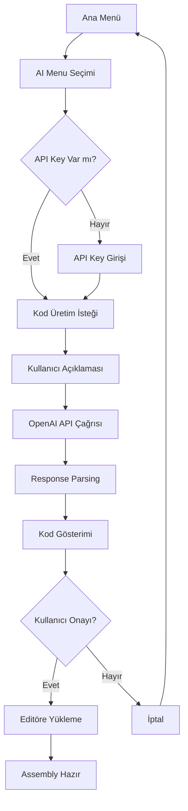

# AI Modülü Dokümantasyonu

## 🤖 assembler.ai Paketi

### Paket Amacı
OpenAI API kullanarak yapay zeka destekli Motorola 6800 assembly kod üretimi sağlar. Kullanıcının doğal dil açıklamalarını geçerli assembly koduna dönüştürür.

### Sınıflar

#### AIAssemblyGenerator.java - AI-Powered Code Generator
```java
public class AIAssemblyGenerator {
    private static final String OPENAI_API_URL = "https://api.openai.com/v1/chat/completions";
    private static final String MODEL = "gpt-4o";           // En güncel model
    private static final MediaType JSON = MediaType.get("application/json; charset=utf-8");
    
    private OkHttpClient client;    // HTTP istemci
    private ObjectMapper objectMapper; // JSON parser
    private String apiKey;          // OpenAI API anahtarı
}
```

### 🎯 Temel Özellikler

#### 1. API Anahtar Yönetimi
- Güvenli API anahtarı saklama
- Runtime'da anahtar değişikliği desteği
- Anahtar doğrulama ve durum kontrolü

#### 2. Kod Üretimi
- Doğal dil açıklamalarından assembly kod üretimi
- Motorola 6800 instruction set'ine uygun kod
- Proper syntax ve addressing mode kullanımı
- Otomatik ORG ve END direktifi ekleme

#### 3. Hata Yönetimi
- API bağlantı hataları
- JSON parsing hataları
- Rate limiting ve timeout kontrolü

### 📡 API İletişimi

#### HTTP Request Yapısı
```json
{
  "model": "gpt-4o",
  "messages": [
    {
      "role": "system", 
      "content": "Motorola 6800 assembly expert..."
    },
    {
      "role": "user",
      "content": "Generate code for: [user description]"
    }
  ],
  "max_tokens": 1000,
  "temperature": 0.3
}
```

#### Response Handling
- JSON response parsing
- Hata durumu kontrolü
- Assembly kod extraction
- Markdown formatting temizleme

### 🔧 Metodlar

#### Core Methods
```java
// API anahtarı ayarlama
public void setApiKey(String apiKey)

// Servis hazır olma durumu
public boolean isInitialized()

// Ana kod üretim metodu
public String generateAssemblyCode(String description) throws Exception
```

#### Internal Helper Methods
```java
// HTTP request body oluşturma
private String createRequestBody(String description)

// JSON string escape
private String escapeJson(String input)

// API response'dan kod çıkarma
private String extractAssemblyCodeFromResponse(String responseBody)

// System prompt oluşturma
private String createSystemPrompt()

// User prompt oluşturma  
private String createUserPrompt(String description)

// Markdown formatting temizleme
private String extractAssemblyCode(String response)
```

### 🧠 AI Prompt Engineering

#### System Prompt Stratejisi
```text
"You are a Motorola 6800 assembly language expert. 
Generate only valid Motorola 6800 assembly code based on user requirements.
Use proper instruction syntax, addressing modes, and include necessary 
directives like ORG and END..."
```

#### Desteklenen İnstructions
- **Data Movement**: LDA, LDB, LDX, STA, STB, STX
- **Arithmetic**: ADDA, ADDB, SUBA, SUBB, INCA, INCB, DECA, DECB
- **Logic**: ANDA, ANDB, ORA, ORB, EORA, EORB
- **Branching**: JMP, JSR, RTS, BRA, BEQ, BNE, BCC, BCS, BPL, BMI
- **Control**: NOP, SWI, WAI, RTI, SEC, CLC, SEI, CLI

### 🔗 Sistem Entegrasyonu

#### UI Katmanı ile Etkileşim
```java
// ConsoleUI.java içinde AI menüleri
public int showAIMenu()                    // AI ana menü
public String getApiKey()                  // API key girişi
public String getAIPrompt()               // Kod açıklaması girişi
public void showApiKeyStatus(boolean)      // API key durumu
public void showGeneratedCode(String)      // Üretilen kodu gösterme
public boolean confirmGeneratedCode()      // Kullanıcı onayı
```

#### App.java ile Koordinasyon
```java
// Ana uygulama içinde AI workflow
private void handleAIMenu()              // AI menü yönetimi
private void setApiKey()                 // API key ayarlama
private void generateCodeWithAI()        // Kod üretim süreci
private void showApiKeyStatus()          // Durum gösterimi
```

### 📊 Çalışma Akışı



### 🛡️ Güvenlik Considerasyonları

#### API Key Security
- Memory'de plaintext saklama (development aşaması)
- Runtime'da key değişikliği imkanı
- Logging'de key masking gereksinimi

#### Rate Limiting
- OpenAI API rate limit'leri
- Timeout ayarları (30 saniye)
- Error retry mekanizması

### 🚀 Kullanım Örnekleri

#### Basit Örnekler
```text
User Input: "Add two numbers"
Generated Output:
    ORG $1000
    LDA #$05        ; Load first number
    ADDA #$03       ; Add second number  
    STA $2000       ; Store result
    END
```

#### Karmaşık Örnekler
```text
User Input: "Count from 1 to 10"
Generated Output:
    ORG $1000
    LDA #$01        ; Start with 1
LOOP:
    STA $2000       ; Store current number
    INCA            ; Increment
    CMPA #$0B       ; Compare with 11
    BNE LOOP        ; Branch if not equal
    END
```

### 🔄 Dependencies

#### External Libraries
- **OkHttp3**: HTTP client için
- **Jackson**: JSON parsing için
- **OpenAI API**: GPT model erişimi

#### Internal Dependencies
- **assembler.ui.ConsoleUI**: Kullanıcı etkileşimi
- **assembler.App**: Ana koordinasyon

### 📈 Future Enhancements

#### Planlanan Özellikler
1. **Multi-model Support**: GPT-3.5-turbo, GPT-4 seçenekleri
2. **Code Optimization**: Üretilen kodun optimizasyonu
3. **Syntax Validation**: Real-time syntax checking
4. **Code Templates**: Hazır kod şablonları
5. **Learning Mode**: Kullanıcı feedback'i ile iyileştirme

#### Teknik İyileştirmeler
1. **Async Processing**: Non-blocking API calls
2. **Caching**: Frequently used patterns caching
3. **Error Recovery**: Automatic retry mechanisms
4. **Performance Metrics**: Response time tracking

### 🧪 Test Stratejisi

#### Unit Tests
- API key validation
- JSON request/response handling
- Error case scenarios
- Prompt engineering validation

#### Integration Tests
- End-to-end code generation
- UI workflow testing
- Error handling flows

### 📝 API Usage Guidelines

#### Best Practices
- Açık ve spesifik açıklamalar kullanın
- Motorola 6800 terminolojisini kullanın
- Karmaşık programları adımlara bölün
- Üretilen kodu her zaman gözden geçirin

#### Rate Limits
- OpenAI API rate limit'lerine dikkat edin
- Gereksiz isteklerden kaçının
- Batch processing için birden fazla requirement'ı tek istekte toplayın

### 📚 Ek Dokümantasyon

- **[AI Testing Guide](AI_TESTING_GUIDE.md)**: Comprehensive testing procedures
- **[Performance Benchmarks](performance.md)**: Speed and accuracy metrics
- **[Troubleshooting Guide](troubleshooting.md)**: Common issues and solutions

### 🔧 Development Notes

- API timeouts: 30 seconds for all operations
- Maximum tokens: 1000 per request
- Temperature: 0.3 for consistent output
- Model: GPT-4o (latest available)

#### Best Practices
1. **Clear Descriptions**: Specific, actionable descriptions provide
2. **Context Aware**: Include any constraints or requirements
3. **Iterative Approach**: Start simple, build complexity
4. **Validation**: Always validate generated code before use

#### Rate Limit Management
- Reasonable request frequency
- Batch processing for multiple requests
- User education about API costs

---

*Bu modül, geleneksel assembly programlama ile modern AI teknolojilerini birleştirerek, öğrenme sürecini hızlandırır ve kod geliştirme verimliliğini artırır.*
